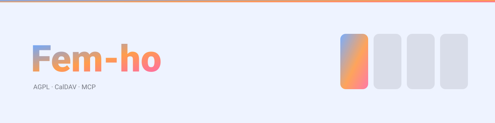

<picture>
  <source media="(prefers-color-scheme: dark)" srcset="docs/img/portada-fosc.svg">
  
</picture>

<p align="right">
  <strong>Català</strong> ·
  <a href="README.en.md">English</a> ·
  <a href="README.es.md">Castellano</a>
</p>

# Fem-ho

Un gestor de tasques i calendari **per a una casa**, pensat per autoallotjar-se. Web, app
d'Android i un servidor que parla CalDAV i MCP.

En català, anglès i castellà.

---

## Per a qui és, i per a qui no

Per a **una llar**: una o més persones adultes que ja tenen un servidor a casa i volen
gestionar la feina, la vida personal i la família al mateix lloc, **sense que la feina
s'assabenti de la família ni al revés**.

No és un producte per a equips d'empresa. No hi ha sprints, ni estimacions, ni informes de
velocitat, ni permisos granulars per camp. Hi ha persones que comparteixen una casa i,
algunes d'elles, també una feina.

## Les cinc idees que el governen

**1 · D'una mirada.** La pantalla principal ha de respondre «què he de fer» sense clicar
res. Si per saber què toca avui cal navegar, el disseny ha fallat.

**2 · Afegir ha de ser instantani.** Escriure una tasca no obre cap finestra: s'escriu en
un camp i s'apreta Enter. La riquesa —venciment, adjunts, instruccions per a la IA—
arriba després, editant.

**3 · Les dades són teves.** CalDAV en les dues direccions, API oberta, exportació
completa. Fem-ho pot ser la font principal o un client d'un calendari que ja tens. Tries
tu, i **pots marxar quan vulguis**.

**4 · La IA és un col·laborador amb corretja.** Pot llegir el que li deixis llegir i
escriure el que li deixis escriure, cada cosa que fa queda registrada i es pot desfer, i
**mai és responsable d'una tasca**: sempre hi ha una persona al darrere.

**5 · Una sola app amb dues formes.** Web i Android són la mateixa cosa adaptada. Qui
passi del mòbil a l'ordinador no ha de reaprendre res.

## Què el distingeix

- **Àmbits, no projectes solts.** Personal, feina i família conviuen al mateix tauler i es
  filtren amb un clic. Una tasca sempre pertany a un àmbit; pot no tenir projecte.
- **La bústia és el dia sencer.** No només les teves tasques: els calendaris subscrits i
  els canals RSS hi entren al costat, i es navega dia a dia. D'una cita se'n pot fer una
  tasca, i mentre la tasca visqui la cita no et reclama res.
- **CalDAV de veritat**, en les dues direccions. El calendari del telèfon i el de
  l'ordinador veuen el mateix, i un `.ics` o un RSS externs es poden posar com a font.
- **Tot deixa rastre.** Cap escriptura arriba a la base sense una entrada a l'historial
  dins de la mateixa transacció. No és una funció: és una invariant que una comprovació
  permanent fa complir.

## Com s'engega

```bash
curl -O https://raw.githubusercontent.com/borborborja/fem-ho/main/compose.yaml
curl -o .env https://raw.githubusercontent.com/borborborja/fem-ho/main/.env.example
# Posa el teu domini a FEMHO_BASE_URL
docker compose up -d
```

I a `http://localhost:8080` hi ha `/setup`, que crea el primer administrador i tanca la
porta per sempre. Amb Postgres en comptes de SQLite, `compose.postgres.yaml`.

La imatge és multi-arquitectura (`amd64` i `arm64`), o sigui que va igual en un servidor
que en una Raspberry Pi:

```
ghcr.io/borborborja/fem-ho:latest        # o :0.6.0 per fixar la versió
```

### El `compose.yaml`

Un sol contenidor i un sol volum. Per a una casa, això és tot el desplegament:

```yaml
services:
  femho:
    image: ghcr.io/borborborja/fem-ho:latest
    restart: unless-stopped
    ports:
      - '8080:8080' # l'aplicació i l'API
      - '8081:8081' # CalDAV, port propi dins del mateix procés
    volumes:
      - femho-data:/data
    environment:
      FEMHO_BASE_URL: https://femho.example.com
      FEMHO_DATABASE_URL: sqlite:///data/femho.db

volumes:
  femho-data:
```

**El volum és tot el que hi ha per guardar**: la base, el secret de la instància, els
adjunts i una còpia prèvia a cada migració. Una còpia del volum és una còpia de
seguretat completa.

### Les opcions

Al `.env` del costat, que Compose llegeix sol. Les que es toquen més:

| Variable                   | Per defecte               | Què fa                                                                                             |
| -------------------------- | ------------------------- | -------------------------------------------------------------------------------------------------- |
| `FEMHO_BASE_URL`           | —                         | **Obligatòria en producció.** Sense això, CalDAV i els enllaços compartits generen URL incorrectes |
| `FEMHO_INSTANCE_NAME`      | `Fem-ho`                  | El nom que veu qui s'hi connecta                                                                   |
| `FEMHO_DATABASE_URL`       | `sqlite:///data/femho.db` | SQLite o `postgres://…`                                                                            |
| `FEMHO_ALLOW_REGISTRATION` | `false`                   | Qualsevol es pot fer un compte. **El primer serà administrador**                                   |
| `FEMHO_GRAVATAR`           | `false`                   | Les fotos de perfil surten de Gravatar                                                             |
| `FEMHO_MAX_UPLOAD_MB`      | `25`                      | Mida màxima d'un adjunt                                                                            |
| `FEMHO_SECRET`             | es genera                 | El pebre de tots els tokens. Entra a la còpia de seguretat                                         |

**[La llista sencera és a `docs/DEPLOY.md`](docs/DEPLOY.md)** —catorze variables, amb el
que costa cadascuna— i no n'hi ha cap més: una comprovació permanent compara el que
llegeix el codi amb el que diuen els documents i falla en les dues direccions. Si en veus
una en un tutorial i no és allà, no existeix.

Els detalls d'operació —proxy invers amb els verbs de CalDAV, còpies de seguretat,
restauració, actualitzacions— són a [`docs/DEPLOY.md`](docs/DEPLOY.md) i
[`docs/BACKUP.md`](docs/BACKUP.md).

## Com es desenvolupa

```bash
npm ci
npm run build
npm test                 # unitàries, SQLite
npm run test:postgres    # les mateixes, contra Postgres
npm run check            # les quinze comprovacions permanents
npx playwright test      # navegador, contra un servidor real
npm run test:android     # Kotlin pur, sense emulador
```

### Les quinze comprovacions permanents

No són linters de format: cadascuna impedeix **una manera concreta de trencar el producte
sense que res falli**. Totes tenen autoprova, perquè una comprovació que diu "verd" sense
comprovar res és pitjor que no tenir-la.

|                           | Què impedeix                                                        |
| ------------------------- | ------------------------------------------------------------------- |
| `openapi-diff`            | Tocar un handler sense actualitzar el contracte                     |
| `vocab-lint`              | Que el vocabulari del prototip s'infiltri al codi (`column: 'fet'`) |
| `no-hardcoded-colors`     | Un color escrit a mà que no segueixi el tema ni l'accent            |
| `i18n-lint`               | Text escrit al codi en comptes del catàleg                          |
| `i18n-parity`             | Una clau o un marcador `{x}` que falti en un idioma                 |
| `i18n-keys-exist`         | Una errata a `t('...')`, que compila i s'ensenya crua a la cara     |
| `no-pinned-from-research` | Una versió de dependència sense procedència registrada              |
| `no-ignored-sources`      | Codi font que `.gitignore` s'empassa i que qui cloni no tindrà      |
| `env-documented`          | Una opció documentada que el codi no llegeix, o a l'inrevés         |
| `scope-predicate`         | Una segona còpia de "qui pertany a un àmbit", que divergiria        |
| `contrast-check`          | Contrast per sota de l'AA als vuit temes                            |
| `audit-coverage`          | Un camí d'escriptura que no deixi rastre a l'historial              |
| `parser-parity`           | Que el parser de la web i el d'Android divergeixin                  |
| `tokens-parity`           | Que els colors de Compose s'endarrereixin respecte del CSS          |
| `css-classes`             | Una classe que no existeix — es veu sense estil i res falla         |

## Com està fet

Monorepo amb npm workspaces:

```
apps/server      Fastify (/api/v1) · node:http (CalDAV) · MCP · SSE · feines programades
apps/web         React + Vite, PWA amb cua de sortida
apps/android     Kotlin + Compose, Room i UnifiedPush
packages/contracts       openapi.yaml, catàlegs d'idioma, parser i índex fraccional
packages/design-system   Plou vendoritzat + els components de Fem-ho
tools/checks     les quinze comprovacions
docs/            quinze documents normatius
```

**El que han de compartir la web i Android viu a `packages/contracts`**, i es compara amb
fixtures: l'índex fraccional, el parser d'afegida ràpida, els catàlegs i el primer dia de
la setmana. Si cadascú ho calculés pel seu compte divergirien un dia, i cap de les dues
donaria cap error.

L'estat honest del producte —què està provat, què necessita un dispositiu i què encara no
hi és— és a [`docs/ESTAT.md`](docs/ESTAT.md).

## Llicència

**GNU AGPL-3.0-or-later.** Veure [`LICENSE`](LICENSE).

Vol dir que el pots fer servir, estudiar, modificar i redistribuir, amb dues condicions:

- **Cita l'origen.** Els avisos de copyright i de llicència es mantenen, i els canvis es
  marquen com a canvis.
- **El que en surti ha de ser igual d'obert.** Un derivat es distribueix sota la mateixa
  llicència, no sota una de més tancada.

I una tercera que és la raó de triar l'**A**GPL i no la GPL a seques: Fem-ho està fet per
**servir-se per xarxa**. Si en publiques una versió modificada i la gent hi accedeix per
la xarxa, els has d'oferir el codi d'aquella versió, encara que no els n'entreguis cap
còpia. Sense això, qualsevol el podria oferir com a servei de pagament sense tornar mai
res, que és exactament el que "igual d'obert" vol evitar.

El que **no** cobreix: el design system **Plou** (`packages/design-system/plou/`) ve d'un
projecte a part i porta les seves pròpies condicions, i la tipografia Roboto és de Google
sota Apache 2.0. Tot plegat, a [`NOTICE`](NOTICE).

> Si algun dia vols publicar l'APK a Google Play, val la pena mirar-s'ho: les condicions
> de Play han tingut friccions conegudes amb les llicències de la família GPL. F-Droid no
> en té cap.
