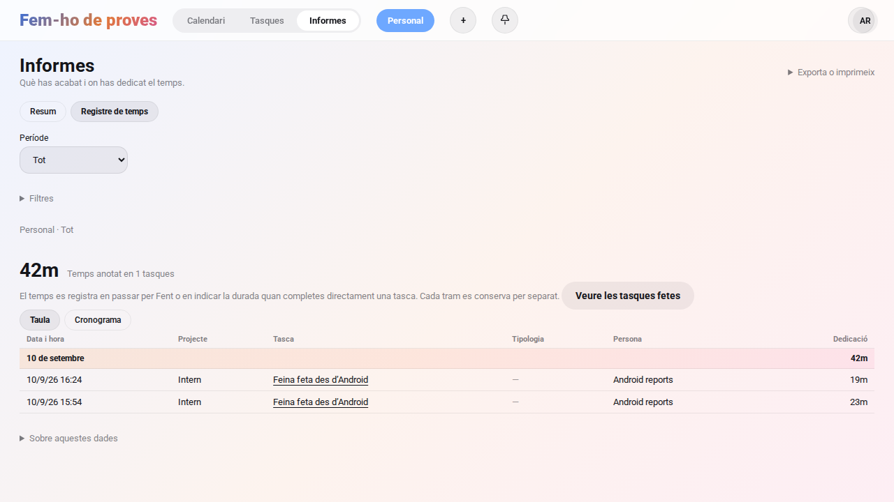
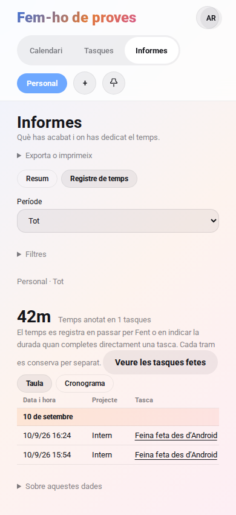

# Auditoria d’Android, dedicació i widgets · 10 de setembre de 2026

## Resultat i abast

Revisió del codi dels nou mòduls d’Android, dels punts d’entrada del manifest, de la cua local, del contracte HTTP i del registre compartit amb la web. Implementació del widget configurable i correcció dels defectes reproduïts del circuit tasca → sincronització → sessions → informes.

Aquesta auditoria **no certifica tota l’app lliure d’errors**. La compilació, les proves JVM amb servidor real i la inspecció visual del navegador són evidències diferents d’una prova d’Android instal·lat. Les integracions externes i els pendents es detallen més avall.

## Canvis implementats

| Problema | Correcció i evidència |
| --- | --- |
| Android movia tasques amb SQL des de `/sync/batch`, sense obrir/tancar sessions ni aplicar els efectes del servei de tasques. | Creació, edició, moviment i esborrat de tasques del lot passen pels serveis comuns. Proves de sessions, data de finalització, permisos de tokens i cascada de subtasques. |
| Diversos moviments offline es fusionaven en l’últim. Es perdien els trams intermedis. | Cada moviment conserva una operació i l’hora del gest. Dos trams de 23 i 19 minuts arriben separats i sumen 42 minuts. |
| Els moviments del mateix mil·lisegon s’ordenaven per UUID. | Desempat per ordre d’inserció de la cua, després de l’hora. Creació i moviment actualitzen tasca i cua en una transacció Room. |
| Dos clients del repositori podien enviar la mateixa cua alhora. | Pany compartit entre app, worker i widget. Idempotència del servidor desada amb la mutació, en una transacció; bloqueig per operació a PostgreSQL. |
| Un refresc podia substituir una tasca tocada mentre s’esperava la resposta de xarxa. | Conservació de les tasques amb operacions pendents en aplicar la instantània; el refresc comparteix el pany d’enviament. |
| Un reintent podia duplicar sessions i la reconstrucció podia emprar l’hora de sincronització. | Reutilització d’`op_id` i reconstrucció amb l’hora original del gest. Activar/desactivar el tracking no duplica els dos trams comprovats. |
| El registre natiu podia quedar ocult perquè encara no s’havien carregat els àmbits. | La càrrega de configuracions obté els àmbits abans de decidir si mostra Registre i Estadístiques. Aquestes pantalles ja existien, condicionades al tracking. |
| Els filtres manuals del registre i el dia del cronograma no desencadenaven la consulta adequada. | La recàrrega depèn de les dates i del dia/vista seleccionats. El període inicial de 30 dies inclou avui i els 29 dies anteriors. |
| El cronograma natiu tractava UTC com a hora local; el desplaçament barrejava píxels i dp; recarregava abans de desar. | Conversió a la zona del dispositiu, desplaçament amb la densitat real i recàrrega després de l’èxit. Només els blocs tancats i editables admeten arrossegament. |
| Els trams curts podien semblar de zero minuts a Android. | Les files de menys d’un minut mostren segons. Els totals continuen seguint l’arrodoniment del servidor. |
| Ajustos d’Android mostrava valors constants i el selector del mode d’àmbits no tenia acció. | Controls vinculats als valors locals persistits; el mode es desa al servidor i s’hidrata quan es carrega. |
| Una fallada de xarxa en moure o carregar checklists fixades podia acabar en una excepció sense gestionar. | El moviment local es conserva; els errors d’aquestes peticions no fan caure l’app. |
| Una altra app podia invocar el receptor d’accions de notificació. | `NotificationActionReceiver` deixa de ser exportat; els PendingIntent continuen podent executar les accions. |
| La taula d’informes eixamplava la pàgina fins a 668 px en un mòbil de 390 px. | Columna de grid amb mínim zero; el desplaçament queda dins la taula. Reproducció i comprovació al navegador. |

## Widget de tasques

- En afegir **Fem-ho · Tasques** s’obre una configuració obligatòria: Inbox, Per fer o Fent.
- Cada instància conserva la seva selecció. Es pot canviar amb **Configura** o amb la reconfiguració del llançador.
- Tocar una tasca avança un pas: Inbox → Per fer → Fent → Fet. La tasca surt del widget quan ja no pertany a la columna seleccionada.
- El canvi s’escriu localment i WorkManager el sincronitza quan hi ha connexió. El widget indica si hi ha canvis pendents.
- El callback comprova el compte, l’àmbit i l’estat actual. Un segon toc sobre una fila antiga no avança dues columnes.
- Es mostren fins a 25 tasques, ordenades per posició, dins d’una llista desplaçable. Respecta els àmbits actius, el tema i l’idioma.
- En tancar sessió es repinten els widgets. El widget separat d’Avui conserva la seva funció.
- La configuració valida l’identificador i retorna cancel·lació si no es desa. La selecció té semàntica de botons de ràdio. Les regles de R8 preserven els callbacks.

La configuració segueix el [contracte oficial de configuració de Glance](https://developer.android.com/develop/ui/compose/glance/configuration). Per passar l’identificador al sistema s’empra l’API pública `GlanceAppWidgetManager.getAppWidgetId`, sense accedir a classes restringides.

## Informes: què queda comprovat

1. La prova HTTP reprodueix dos trams offline de **23 + 19 minuts**, la reobertura d’una tasca feta i el reenviament del mateix lot: **2 sessions, 42 minuts i 1 tasca**, sense duplicats.
2. Una tasca creada offline directament a Fent també conserva l’hora d’inici. Completar-la aplica la cascada de subtasques.
3. Un rellotge invàlid o avançat més de cinc minuts, un estat remot incompatible o un moviment anterior al treball ja registrat es rebutgen. El client conserva l’operació pendent. Petites desviacions cap al futur es limiten a l’hora del servidor.
4. `TimeReportsIntegrationTest` executa **el Repository i FemhoApi reals d’Android, a la JVM**, contra un servidor aïllat: crea una tasca, acumula dos trams sense enviar-los, sincronitza i desserialitza el registre i les estadístiques natius. Utilitza un DAO controlat; **no substitueix una prova Room en dispositiu**.
5. Playwright comprova les dues files, els minuts, el resum i l’amplada mòbil. També passen les proves existents de visibilitat d’Informes, filtres, idiomes/temes i durada en completar.

**Dades antigues:** els gestos descartats per la fusió de la cua antiga no es poden reconstruir amb exactitud. Aquesta correcció conserva els nous trams; no inventa el temps que no es va registrar. El tracking ha d’estar activat a l’àmbit. Cal actualitzar **servidor i APK** per conservar l’hora offline de manera completa.

## Cobertura de la revisió i pendents

| Àrea | Revisió i límit |
| --- | --- |
| Tasques, cua i sessions | Codi, proves Kotlin, HTTP i navegador; integració JVM amb servidor real. Falta exercitar Room i gestos en un dispositiu amb el nou APK. |
| Registre/Estadístiques natius | Revisió del model, consultes, permisos, dates i cronograma; compilació. La verificació visual nativa queda pendent de l’emulador. |
| Ajustos, autenticació i navegació | Revisió de persistència, càrrega i punts d’entrada. No s’ha completat un recorregut manual de totes les pantalles Android. |
| Calendari, correu, adjunts i compartits | Revisió de connexions UI/API i permisos al servidor coberts per la suite existent. Sense DAVx⁵, compte IMAP o proveïdor extern reals en aquesta passada. |
| IA i delegació | Revisió del camí de presa de control; queda el pendent específic següent. Sense agent extern executant feina real. |
| Notificacions i widget | Manifest, Glance, WorkManager, recursos, R8 i compilació. UnifiedPush amb distribuïdor i llançadors de fabricants no s’han provat. |
| Disseny, traduccions i empaquetat | Catàlegs ca/en/es regenerats, tokens/contrast i comprovacions del repositori. Lint inclou avisos previs que no s’han silenciat. |

Pendents prioritzats identificats pel codi, que **no es donen per resolts** en aquest canvi:

- **P1 · Canvi de compte o servidor.** La base Room i l’outbox actuals són globals al dispositiu. El tancament de sessió neteja tokens, però no separa la memòria cau ni les operacions pendents per identitat. Cal dissenyar particions per compte, migrar la cua sense perdre operacions i provar canvis de compte offline. La guarda del callback del widget no resol l’aïllament de tota la memòria cau.
- **P1 · Mutacions de sync d’entitats diferents de tasques.** Encara hi ha actualitzacions/esborrats genèrics en lloc dels serveis de cada entitat. Cal ampliar la política centralitzada i les proves de permisos/cascades a subtasques, checklists, projectes, comentaris i esdeveniments. La correcció d’aquest lliurament cobreix els moviments i les altres escriptures de tasques.
- **P1 · Prendre el control d’una tasca delegada.** `takeOverTask` canvia l’estat directament i no aplica l’obertura/tancament de sessions del moviment normal. Cal unificar aquesta transició i comprovar també la reobertura des de Fet.
- **P2 · Paritat Android/web.** El modal de durada en completar directament, els rellotges a les targetes i el selector de visibilitat d’Informes de la web encara no tenen la mateixa implementació nativa. El nou widget passa sempre per Fent abans de Fet.
- **P2 · Errors i conflictes.** Algunes operacions en línia capturen l’error sense mostrar-lo. La cua conserva conflictes, però falta una pantalla per resoldre’ls; una operació rebutjada pot aturar les posteriors.
- **P2 · Cronograma natiu.** Queden per millorar l’ajust a l’amplada disponible, les sessions que se solapen i la paritat de redimensionament amb la web. També falta aplicar la zona configurada al perfil si difereix de la del dispositiu.

Els avisos TLS de Lint corresponen a la sonda que llegeix el certificat per mostrar-ne l’empremta; el client autenticat utilitza el magatzem de confiança o el certificat confirmat. El receptor UnifiedPush és exportat per comunicar-se amb el distribuïdor. Aquests avisos requereixen interpretar el camí real, no eliminar-los indiscriminadament.

## Verificació reproduïble

- `npm run build`, `npm run typecheck`, `npm run lint`, `npm run check`, `npm run format:check`.
- Suite Vitest: 1.199 proves satisfactòries i 5 omeses. Dues proves van superar el temps màxim quan corrien juntament amb Gradle i l’emulador; reexecutades aïlladament, les 27 proves d’aquests dos fitxers passen.
- Playwright: les 6 proves existents d’informes/temps passen; la prova nova de sincronització Android i informes passa després de corregir el desbordament.
- Les proves del servidor d’aquesta passada utilitzen SQLite. PostgreSQL i Docker/arm64 no s’han executat localment.
- Android: `:core-model:test`, `:core-data:testDebugUnitTest`, `:app:assembleRelease`, `:app:lintDebug`. 115 proves Kotlin satisfactòries, APK release construït i Lint sense errors (425 avisos i 2 suggeriments). La darrera execució de Lint s’ha fet en un procés nou amb 4 GB de heap i un treballador després d’un esgotament de memòria del procés anterior.
- Integració nativa JVM: servidor buit amb registre activat i `FEMHO_ANDROID_TEST_URL=http://localhost:8180`. La prova es marca omesa si no es proporciona aquest servidor aïllat.

S’ha intentat arrencar un AVD nou sense tocar cap emulador amb dades prèvies. Aquesta sessió no té permís sobre `/dev/kvm`, a diferència del que assumeix l’AGENTS.md. Després de més de trenta minuts, l’arrencada per programari seguia a la pantalla de Google, sense servei de widgets operatiu. La instal·lació de prova no s’ha completat i s’ha aturat aquest emulador aïllat: **no hi ha evidència de l’APK release instal·lat ni de la configuració/clics del widget al llançador**. Cal completar aquesta prova abans de considerar validada la interacció nativa en producció.
